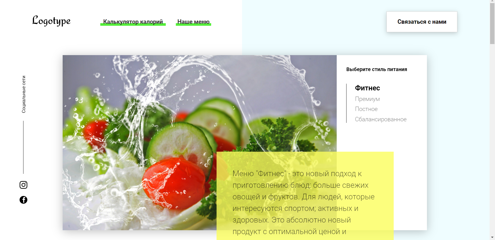

# Food menu
Pet-project completed as part of the course on Udemy. Implemented the functionality of the calorie calculator.

> - [Live Demo](https://khorek.github.io/food-menu/) :food:

## Getting Started
This project is not necessary install special code or dependencys
- Clone or download this repo
- in terminal "npx webpack" for start project
- in terminal "json-server db.json" for render cards menu from json server

## Practiced:
- Webpack
- Module system js
- json-server
- bundle 
- jQuery 
- Bootstrap.

## Authors
Kir Khorev

## License
This project is licensed under Unlicense license.
Copyright (c) 2021
